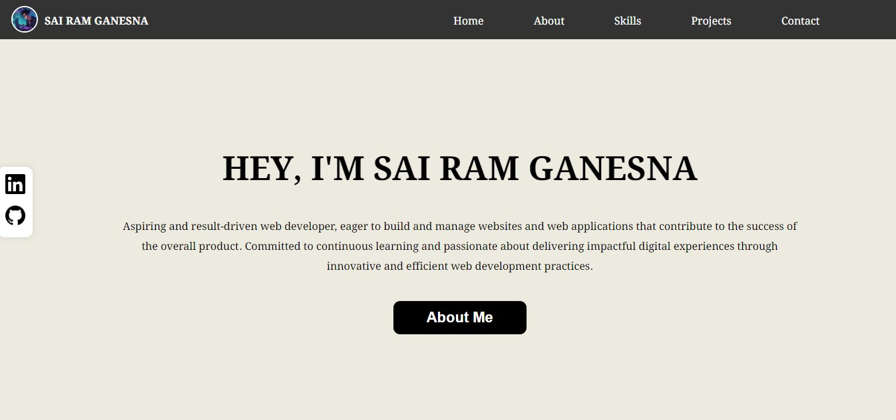
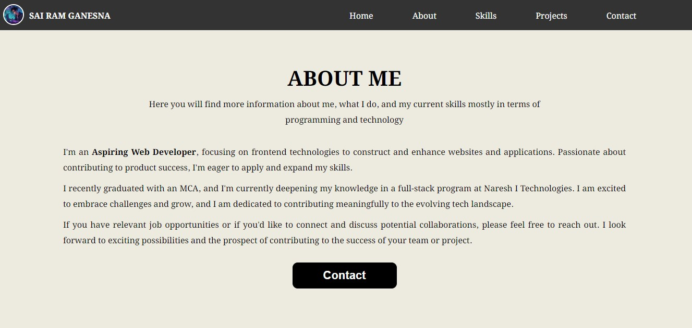
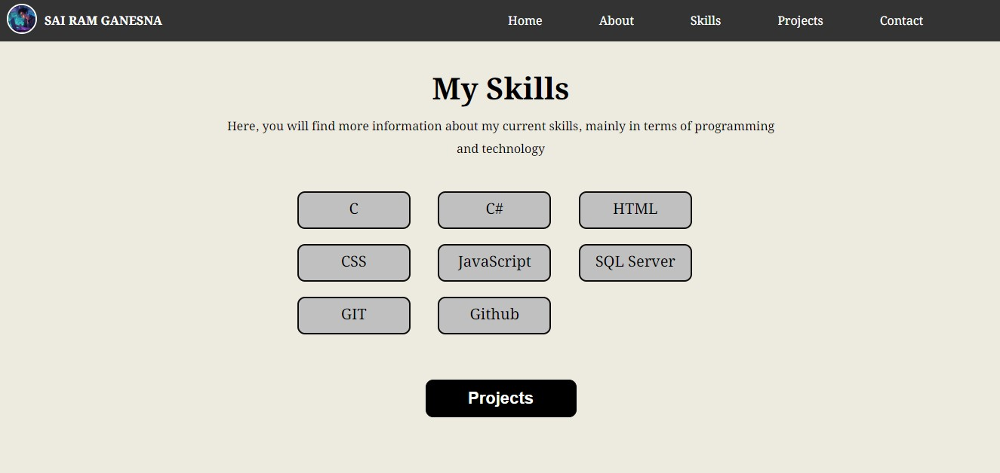
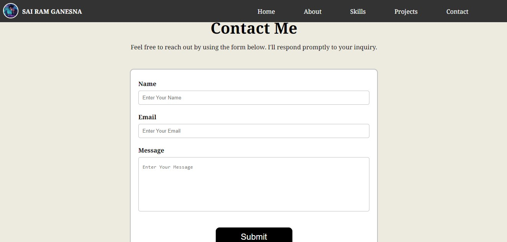

# PORTFOLIO

  
<strong>Table of Contents</strong>

1. Description
2. Screenshots
3. Technologies used
4. Installation Instructions
5. License

## Description

Welcome to my portfolio website. It showcases my skills and projects. Explore my background, key projects, and connect with me.

## Screenshots

## Technologies Used

- HTML5
- CSS3
- JavaScript

## Installation Instructions

To run this project locally, follow these steps:

1. Clone this repository to your local machine.
2. Open the Main.html file in your web browser.

## License

This project is licensed under the MIT License - see the [LICENSE](LICENSE) file for details.

